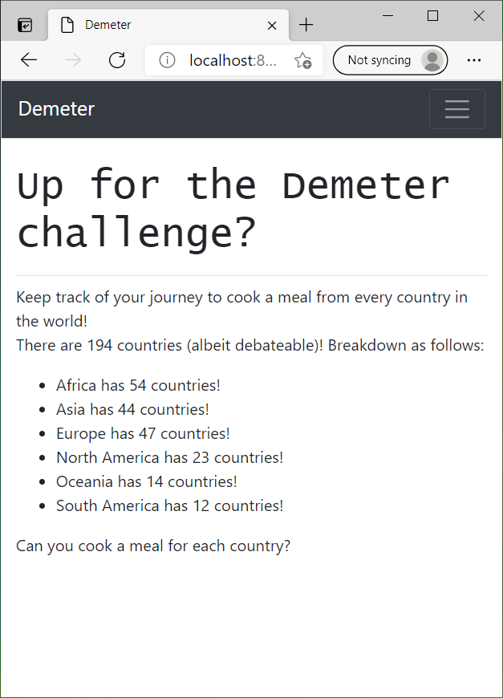
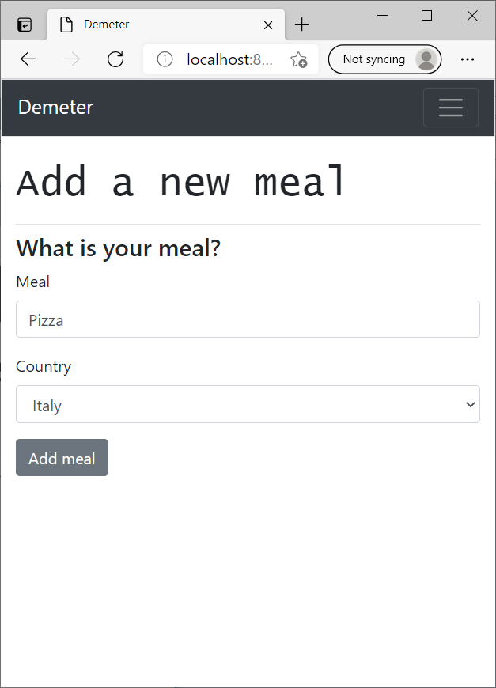

# Demeter
Help you choose your next worldly meal!

## Description
This is a web app for you to keep track of quest to cook a meal from every country in the world!  You can create an account, add meals from different countries, and see your progress.  It will even suggest your next country based on the continent you have completed the least, as well as suggest a meal from it (this will be a national dish, but you can research your own!).

## Dependencies
* Python 3.8 (has not been tested above or below this version).
* Django 3.1 (please checkout.

## Installing
* You can download the code from the Demeter repository by clicking "Code", then "Download".
* You will need to set up you own Django app.  For details on how to set up Django, please see the [docs] (https://docs.djangoproject.com/en/3.2/topics/install/).
* Please note that an example has not been set up on heroku to view.  Please see the [heroku docs](https://devcenter.heroku.com/articles/getting-started-with-python) for information on how to do this.

## How to use this app
* Register!: You can register an account by using the Register button in the toolbar, or
* Log in!: if you already have an account.
* If you have forgotten your password, you can request a reset.  Please visit the [Django docs](https://docs.djangoproject.com/en/3.2/topics/auth/default/) for information on how to set this up.
* Change password?: If you are already logged in, you can click this link in the toolbar to request a password change.
* Add a Meal!: You can click this link in the toolbar to add a meal that you have cooked, entering a meal name and choosing a country of the selection of all the countries in the world (this can be up for debate).

* Your Meals!: This will display a list of the meals you have told us you have cooked.
* Meal Statistics!: From the "Your Meals" screen, you can visit your meal statistics.  This will display the list of all the countries you have completed (they can't be counted twice), will show the percentage of countries completed for each continent, as well as in total, and will even suggest a meal from a new country!

## Authors
Marc Jowett (carkzis.apps@gmail.com)

## Version History
* 1.0
  * Initial Release.  See [commits](https://github.com/Carkzis/Demeter/commits/main).

## License
This is licensed under the BSD-3-Clause License.  You can see the LICENSE.md for further details.

## Acknowledgments
[Eric Matthes](https://ehmatthes.com/) - I owe a large part of his book, Python Crash Course, in helping me code this app.  I emplore you to check it out if you have not already done so.
